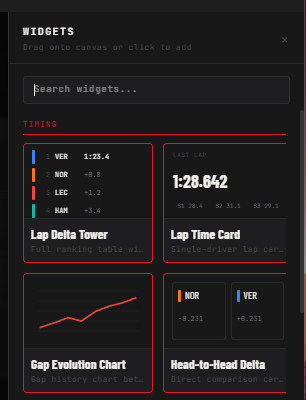
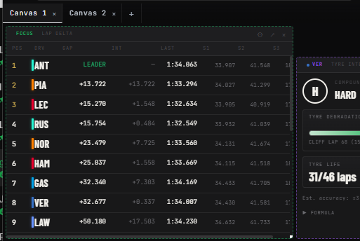
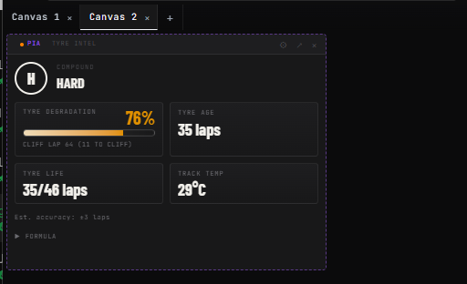
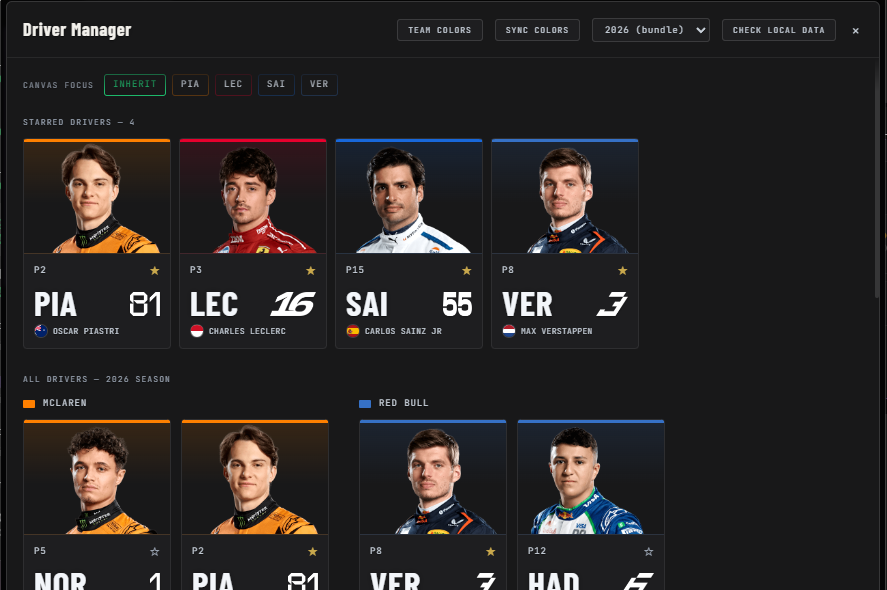
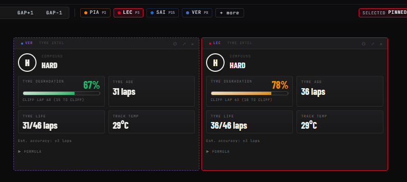
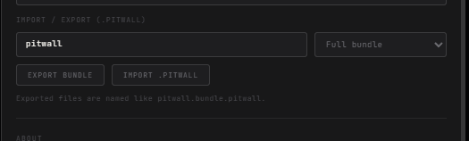
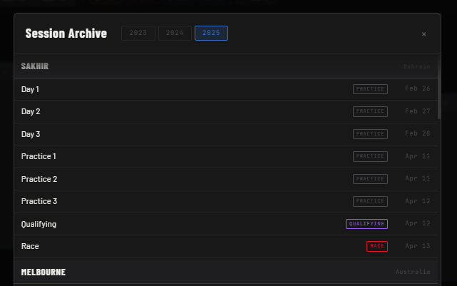
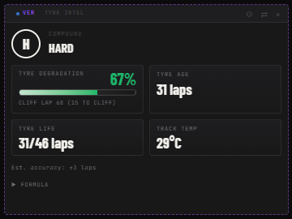

# Pitwall

  

  <strong>Fan-built F1 race intelligence platform powered by OpenF1</strong> 
  Real-time telemetry, inferred strategy metrics, ambient race state UI, and shareable multi-canvas layouts.

  
  
  
  

> Not affiliated with Formula 1, FIA, or Formula One Management.

## Contributing

For contributing, see [CONTRIBUTING.MD](https://github.com/Ethan-Ka/Pitwall/blob/main/CONTRIBUTING.MD)

---

## Intro

Pitwall is built for fans who want team-style race context in one place: timing, telemetry, strategy, weather, radio events, and inferred signals that OpenF1 does not expose directly.

The goal is to make race intelligence configurable, shareable, and useful in real time.

Works great with [F1 Sensor](https://github.com/Nicxe/f1_sensor)

---

## Features

Implemented outcomes in the current product:

| Area | Current result |
|---|---|
| Canvas and workspace foundation | Multi-tab canvas with persistent layout state |
| Driver targeting system | Focus, role-based, and pinned driver modes |
| Ambient race-state UX | Flag-driven top bar with smooth transitions and event pulses |
| Season content | 2026 assets, manifests, and team/driver metadata |
| Standings coverage | Live projected driver and constructor standings |
| Historical continuity | Archive mode support for historical race browsing |

### Widget catalog coverage

Pitwall targets a 33-widget catalog across timing, telemetry, tyres, map, weather, audio, championship, and visual views.

### Workspace flexibility

Different workspaces can follow different race stories at the same time.

| Workspace 1 | Workspace 2 |
|---|---|
|  |  |

### Multi-widget, multi-driver analysis

Multiple instances of the same widget can target different drivers in parallel.

| Driver manager and starring | Same widget type, different driver targets |
|---|---|
|  |  |

### Export/import system

Pitwall layouts can be exported and imported so users can move setups between devices and share race dashboards.

Season updates and changes will be released through season `.pitwall` files and bundled with the latest updates.

### Historical race feature

Archive mode keeps historical race analysis available when live feed is unavailable.

### Inference engine

OpenF1 does not expose direct ERS state, battery level, tyre wear %, fuel load, or engine mode. Pitwall computes estimated values from available telemetry and session data.

---

## Planned features (from master plan)

The following roadmap items are pulled from [plan/pitwall_master_final.html](plan/pitwall_master_final.html).

| Master plan section | Planned feature | Summary |
|---|---|---|
| 03 Ambient race layer | Ceremonial start/end lighting scenes | Event-driven temporary scenes with safety-state override priority |
| 10 Weather radar integration | Enhanced radar controls | Geo-locked map behavior and richer weather-layer workflow |
| 11 Advanced radio scanner | Transcription intelligence | Whisper-based transcript pipeline and keyword elevation |
| 12 F1TV and stream overlay | Desktop overlay mode (Phase 4) | Transparent always-on-top overlay architecture |
| 12 F1TV and stream overlay | Multi-window overlay composition | Synchronization between main app and overlay contexts |
| 14 Inference engine | Community formula evolution | Better formulas, validation workflow, and sharable improvements |
| 16 Tech stack and build phases | Mobile and TV companion modes | Responsive/mobile and lightweight companion experiences |
| 17 Plugin SDK and creator wiki | Custom widget plugin support | User-installable widgets with permissions and sandbox boundaries |
| 17 Plugin SDK and creator wiki | Official plugin creator wiki | SDK reference, testing guidance, publishing process, examples |

---

## Data source

All race data comes from OpenF1.

| Tier | Cost | Access |
|---|---|---|
| Historical | Free | 2023 onward sessions, replayable data |
| Live | $10/month (your own key) | Real-time updates and authenticated endpoints |

Pitwall does not proxy live OpenF1 traffic. Users provide their own API key and calls go directly to OpenF1.

---

## License

[LICENSE](https://github.com/Ethan-Ka/Pitwall/blob/main/LICENSE)

OpenF1 data is used under OpenF1 terms. F1, FORMULA ONE, FORMULA 1, FIA FORMULA ONE WORLD CHAMPIONSHIP, GRAND PRIX and related marks are trade marks of Formula One Licensing B.V.
