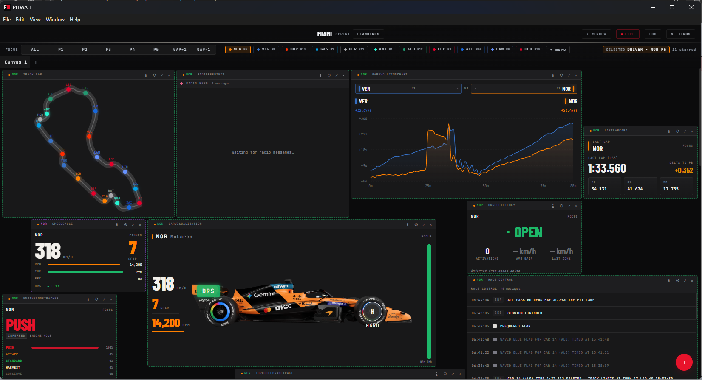

# Pitwall - Release Branch

  

  <strong>Fan-built F1 race intelligence platform powered by OpenF1</strong> 
  Real-time telemetry, inferred strategy metrics, ambient race state UI, and shareable multi-canvas layouts.

  
  
  
  
  

> Not affiliated with Formula 1, FIA, or Formula One Management.

---
**This branch holds the most current - stable - build of the application**

It will include only finished features, so the main version will be ahead of this branch.

---

## Intro

Pitwall is built for fans who want team-style race context in one place: timing, telemetry, strategy, weather, radio, and inferred signals that neither OpenF1 nor FastF1 expose directly.

The goal is to make race intelligence configurable, shareable, and useful in real time — with 36 fully implemented widgets across 8 categories, a flexible multi-canvas workspace, and a driver targeting system that keeps every widget pointing at the right car automatically.

*Information is incorrect - testing/demo data*

---

## Contributing

For contributing, see [CONTRIBUTING.MD](https://github.com/Ethan-Ka/Pitwall/blob/main/CONTRIBUTING.MD)

---

## Features

| Area | What's implemented |
|---|---|
| Multi-canvas workspace | Unlimited named tabs, each with an independent persistent widget layout |
| Driver targeting system | FOCUS, position-based (P1–P5), gap-relative (GAP±1), and PINNED modes per widget |
| Ambient race-state layer | Flag-driven top bar with animated transitions, color pulses, and intensity control |
| Season content | 2026 car profiles, team liveries, and full driver and team metadata |
| Widget help system | Per-widget markdown help popovers accessible directly from the widget header |
| Widget picker | Categorized, searchable panel with click-to-add and drag-to-canvas support |
| Standings and championship | Live standings, championship scenario calculator, and multi-race points delta tracking |
| Historical continuity | Archive mode for browsing and analyzing past race sessions |
| Export and import | Full workspace, season, and settings snapshots as portable `.pitwall` files |
| Circuit map caching | FastF1 circuit geometry persisted to localStorage for resilience when the bridge is offline |

---

## Canvas system

Each Pitwall workspace is a **canvas tab** — an independently configured grid of widgets. Tabs are unlimited and fully independent from one another.

### Workspace flexibility

Different canvases can follow completely different race stories at the same time. One tab can track a championship battle while another monitors pit strategy for a different driver group.

| Workspace 1 | Workspace 2 |
|---|---|
|  |  |

### Tab management

- Create tabs with the `+` button in the tab bar. Tabs are named `Canvas 1`, `Canvas 2`, etc. by default and can be renamed by double-clicking.
- Remove any tab with the `×` button — at least one tab must remain open.
- Switch between tabs instantly; each tab restores its own layout and widget configuration.

### Layout

Pitwall uses a 24-column drag-and-drop grid. Widgets can be freely repositioned by dragging their header, and resized by dragging the southeast corner. Each widget type enforces a minimum size. Layout changes save automatically with a short debounce.

### Widget operations

- **Add**: Open the widget picker with the `+` button — search, browse by category, then click or drag to place.
- **Remove**: Click the `×` in the widget header to remove a widget from the current canvas.
- **Resize**: Drag the southeast corner of any widget. Minimum dimensions are enforced per widget type.
- **Pop out**: Widgets can be detached into their own window on Electron builds.

---

## Driver targeting system

Every focus-enabled widget has a **driver context** — a mode that determines which driver's data it displays. Contexts can differ per widget on the same canvas, making it possible to run multiple instances of the same widget pointing at different drivers simultaneously.

### Targeting modes

| Mode | Badge | How it works |
|---|---|---|
| **FOCUS** | Green | Follows the canvas focus driver. If no focus is set, falls through to the window-level selector. |
| **P1–P5** | Gold | Always shows the driver in that live championship or race position. Updates as positions change. |
| **GAP+1** | Gold | Shows the driver one position ahead of the current canvas focus driver. |
| **GAP−1** | Gold | Shows the driver one position behind the current canvas focus driver. |
| **PINNED** | Purple | Locked to a specific driver number, regardless of position or focus changes. |

### Multi-widget, multi-driver analysis

Multiple instances of the same widget can run on the same canvas, each targeting a different driver. The badge in each widget header shows which mode is active and which driver is resolved.

| Driver manager and starring | Same widget type, different driver targets |
|---|---|
|  |  |

---

## Driver manager

The driver manager is the central hub for driver configuration. It handles season data, starred drivers, canvas focus, and team color overrides.

| Feature | Description |
|---|---|
| **Season import** | Select a year and load the bundled season roster, including driver numbers, team assignments, and team colors. |
| **Starring drivers** | Star any driver to make them available as focus and pin targets across the workspace. |
| **Canvas focus** | Set a starred driver as the active canvas focus. Widgets in FOCUS mode will follow this driver. Only starred drivers appear as focus options. |
| **Team color sync** | Apply official team colors from the season bundle to all drivers in one click. |
| **Team color override** | Each team's color can be manually overridden with a hex input and color picker. Overrides persist across sessions. |

### Per-widget driver selection

Each widget has a **Driver** tab in its settings. From there:

- Select **FOCUS** to follow canvas focus.
- Select a position chip (**P1–P5**, **GAP+1**, **GAP−1**) for live position targeting.
- Click a starred driver badge to **PIN** that widget to a specific driver permanently.
- Use **+ more** to open the full driver manager and star additional drivers.

---

## Standings and championship

Championship data is sourced from the Jolpica API and cached locally, refreshing every five minutes as new races complete.

### Standings Board

Displays live race position data in two columns — driver standings on the left with gaps and projected points, constructor stats on the right with team rankings and average positions. Gold highlighting marks the top three in each column.

### Standings Table

Full season championship standings with a toggle between the Drivers' and Constructors' Championships. Shows accumulated points, wins, and races entered for each competitor.

### Championship Calculator

A scenario planning tool for the top eight drivers in the championship. Two modes:

- **Simulate**: Set a hypothetical finish position for each driver. The calculator shows the projected championship order and new points gaps if those results happen.
- **Target**: Choose a driver and a goal (championship position or points target). The calculator shows the minimum result each driver needs to achieve it, color-coded by difficulty.

### Points Delta Tracker

A line chart showing the points gap between the championship leader and second place across every completed race in the season, with a breakdown of race-by-race points swings.

---

## Export and import

Pitwall layouts, settings, and season data can be packaged into `.pitwall` files for backup, sharing, or device migration.

Season updates are distributed as `.pitwall` bundles bundled with each Pitwall release.

### Export types

| Kind | What it includes |
|---|---|
| **Full bundle** | Settings, season data, and workspace layout in a single file |
| **Workspace** | Canvas tabs, widget layout, and per-widget configuration only |
| **Season** | Driver roster, team metadata, and team color overrides only |
| **Settings** | Data source configuration and display preferences only |

Files are standard JSON with a version field and can be inspected or edited manually.

---

## Historical race feature

Archive mode lets you load and explore any completed race session from 2023 onward. All widgets work against historical data in the same way they do during a live session.

---

## Inference engine

OpenF1 does not expose ERS state, battery level, tyre wear percentage, fuel load, or engine mode directly. Pitwall estimates these values from available telemetry and session data using configurable formulas. All inferred values are marked `~EST` in the UI so they are never mistaken for official figures.

Inferred signals currently include ERS deployment by micro-sector, tyre degradation rate by stint, pit window urgency, DRS efficiency delta, and engine mode behavior.

---

## Settings

Settings are accessible from the top bar and are divided into a few areas.

### Data source

Configure which API Pitwall uses and how it connects.

| Option | Description |
|---|---|
| **Data mode** | Switch between Historical (cached and replayable) and Live (requires API key or F1TV auth). |
| **Active data source** | Toggle between OpenF1 and FastF1. Both can be used, but only one is active at a time. |
| **OpenF1 API key** | Enter your personal OpenF1 key for live access. The key is stored locally and never leaves the client. Only the first 8 characters are shown in the UI after entry. |
| **F1TV sign in** (FastF1) | Authenticate with F1TV through the local FastF1 companion bridge. Credentials are not stored outside the client. |
| **Bridge status** (FastF1) | Indicator showing whether the FastF1 companion is reachable. |
| **OpenF1 polling** | Master toggle to pause all API polling without changing other settings — useful for reducing requests during a red flag or break. |

### Ambient layer

| Option | Description |
|---|---|
| **Ambient layer** | Master toggle for the animated background layer behind the workspace. |
| **Wave animation** | Animated wave effect within the ambient layer. Requires the ambient layer to be enabled. |
| **Ambient intensity** | Controls how prominent the ambient layer is. Four levels: 25%, 50%, 75%, 100%. |
| **Leader color mode** | When enabled, the ambient layer and leader badge are tinted with the leading driver's team color. |

### Drivers

Opens the full driver manager. Shows a summary of how many drivers are currently starred and which season is active.

### Workspace

| Action | Description |
|---|---|
| **Reset workspace** | Clears all tabs and widgets and recreates a single empty default tab. |
| **Export** | Choose an export type and filename, then download as a `.pitwall` file. |
| **Import** | Load a `.pitwall` file to restore a workspace, season, settings, or full bundle snapshot. |

### Diagnostics

Export or clear the in-memory diagnostic log. The log captures up to 1000 entries and downloads as JSON.

---

## Planned features

| Area | Feature | Summary |
|---|---|---|
| F1TV overlay | Desktop overlay mode (Phase 4) | Transparent always-on-top overlay for use alongside a broadcast stream |
| F1TV overlay | Multi-window overlay composition | Synchronized widget rendering across the main app and detached overlay windows |
| Inference engine | Community formula evolution | Shareable formula improvements with a validation workflow |
| Tech stack | Mobile and TV companion modes | Responsive layout and a lightweight companion experience for secondary screens |
| Plugin SDK | Custom widget plugin support | User-installable widgets with a permissions model and sandbox boundaries |
| Plugin SDK | Plugin creator wiki | SDK reference, testing guidance, publishing process, and worked examples |

---

## Data sources

Pitwall supports two data sources: OpenF1 and FastF1. They serve different roles and can be switched between in settings.

### OpenF1

OpenF1 is a community-run REST API that exposes F1 timing, telemetry, and race control data.

| Tier | Cost | What's available |
|---|---|---|
| Historical | Free | All sessions from 2023 onward, replayable at any speed |
| Live | $10/month (personal key) | Real-time data during sessions, authenticated polling endpoints |

Pitwall makes all OpenF1 requests directly from the client using your own key — there is no Pitwall proxy. Your key is stored locally only. API polling respects a minimum interval to avoid rate limiting; Pitwall handles 429 responses with an automatic retry guard.

### FastF1

FastF1 provides richer telemetry, circuit geometry, tyre stint breakdowns, and lap data sourced from F1TV. It runs through a local Python companion bridge that you authenticate with your F1TV account.

FastF1 is the recommended source for most users because it does not require a paid API key and provides higher-fidelity data for telemetry and map widgets.

Circuit coordinate data fetched from FastF1 is cached in localStorage, so track layouts and map widgets continue to work if the companion goes offline mid-session.

Pitwall does not store or transmit F1TV credentials. Authentication is handled entirely by the local bridge.

---

## License

[LICENSE](https://github.com/Ethan-Ka/Pitwall/blob/main/LICENSE)

OpenF1 data is used under OpenF1 terms. F1, FORMULA ONE, FORMULA 1, FIA FORMULA ONE WORLD CHAMPIONSHIP, GRAND PRIX and related marks are trade marks of Formula One Licensing B.V.
